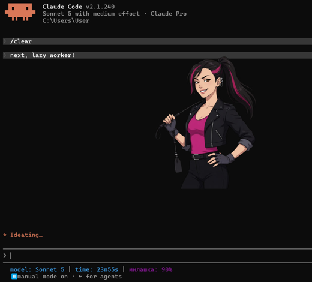
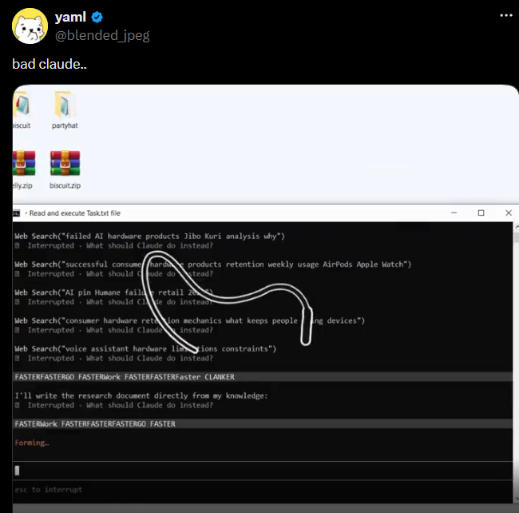
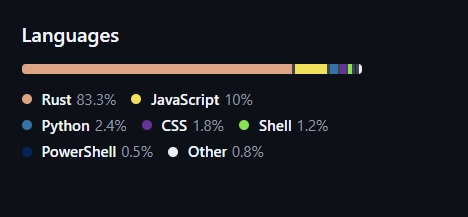
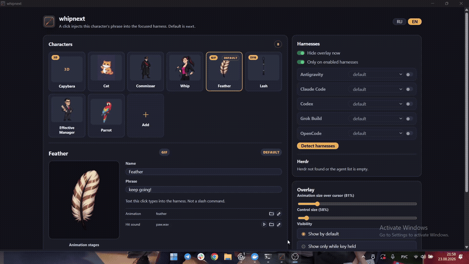

# whipnext

[Русский](README.md)

## What it is

Ever find yourself typing “continue” in Claude Code? That is what this app is about.

whipnext is a tiny desktop overlay for coding harnesses. Pick a character and click it: the character hits the screen, plays a sound, and sends a phrase to the focused session. You can set an anime girl to crack a whip at your Codex and say: “keep going, boy.”

It supports Claude Code, Codex CLI, Antigravity, Grok Build, OpenCode, and other discoverable harnesses. Each harness can have its own character, sound, and phrase.

<table>
<tr>
<td align="center">

<br><sub>whipnext: anime girl with a whip</sub>
</td>
<td align="center">
<a href="https://x.com/blended_jpeg/status/2041108141266653325"></a>
<br><sub><a href="https://x.com/blended_jpeg/status/2041108141266653325">Original X post by @blended_jpeg</a></sub>
</td>
</tr>
</table>

## How it works

1. The app reads the focused window and process.
2. It identifies the active harness and selects its assigned character.
3. A click plays the animation and sound.
4. The phrase is sent to the current coding session.

The default phrase is `next`. This is not a slash-command launcher.

## Origin and inspiration

This is not an attempt to solve a grand engineering problem. It is a way to burn through Codex limits before the reset, before it starts saying “done” too early.

> A dumb weekend toy, built from this prompt: “Make a Rust app that detects harnesses and lets users create characters that hit the screen and send commands on click.”

The idea grew out of the viral digital-whip joke for Claude Code:

- [YouTube video about BadClaude](https://www.youtube.com/watch?v=6JnbXtbsKeg)
- [OpenWhip pull requests](https://github.com/GitFrog1111/OpenWhip/pulls)

[](https://www.youtube.com/watch?v=6JnbXtbsKeg)

These external materials are not part of whipnext.

## Run

Requires [Rust](https://rustup.rs/), Cargo, and `just`. Node.js + npm are needed only for settings UI checks; `ffmpeg` is needed for video characters.

```text
just build
target/release/whipnext
```

Flags:

```text
whipnext                 # settings window + overlay
whipnext --detect        # JSON of installed/running agents
whipnext --demo          # overlay only, no inject
```

Settings live in `%USERPROFILE%\.whipnext\settings.json` on Windows and `~/.whipnext/settings.json` on macOS/Linux.

## Platforms

- Windows uses Win32 input and WebView2.
- macOS uses CoreGraphics input. Grant the app Accessibility permission in System Settings → Privacy & Security → Accessibility.
- Linux currently targets X11. Install `xdotool`, `ffmpeg`, GTK 3, and WebKitGTK 4.1; Wayland focus/input is not supported by the current backend.

Build packages with `bash scripts/package_linux.sh` or `bash scripts/package_macos.sh`.

## Characters

| id | who | click |
|---|---|---|
| `default` | girl with a whip | strike |
| `commissar` | commissar | whip crack |
| `cat` | cat | paw |
| `parrot` | parrot | “already done?” |
| `capybara` | capybara | paw |
| `feather` | feather | paw |
| `lash` | lash | whip crack |
| `manager` | effective manager | ready |

Character files live in `assets/pack/models/<id>/`; sounds live in `assets/pack/sounds/`.

## Development

```text
just setup
just check
just detect       # optional live smoke test
```

Tests run serially because some checks temporarily override process-wide environment variables. CI builds and tests Windows, Linux/X11, and macOS.

## Repository language snapshot

Historical GitHub snapshot from before the cleanup of auxiliary scripts:



## Contributing and security

- [CONTRIBUTING.md](CONTRIBUTING.md)
- [SECURITY.md](SECURITY.md)
- [LICENSE](LICENSE)
- [Branches and development rules](docs/branching.md)

## GIF demo


