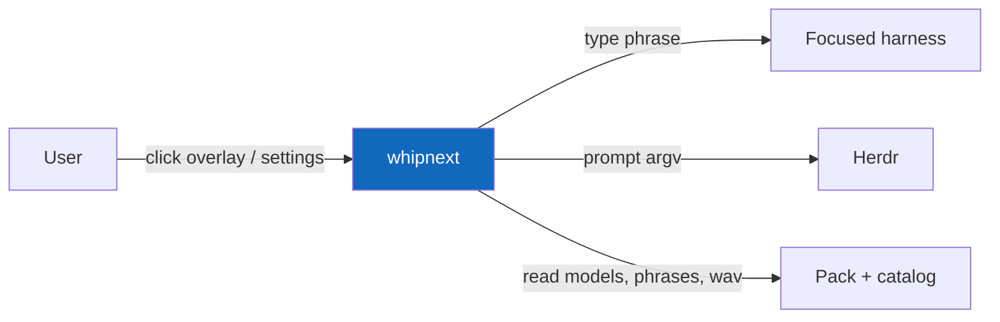
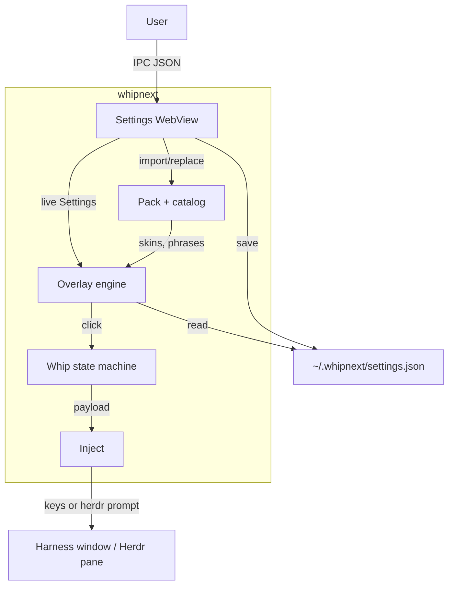
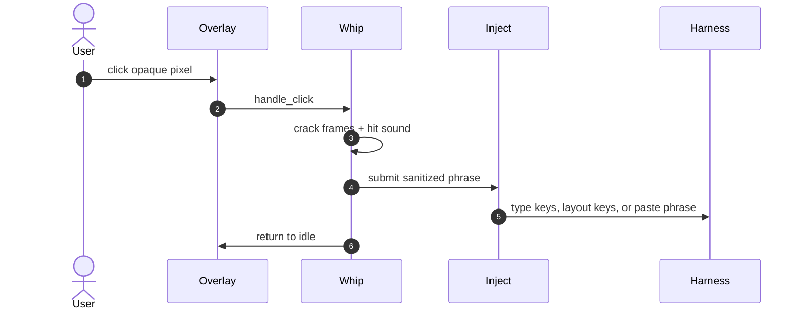

# Architecture

Two zoom levels: the system among other processes, then the parts inside the binary. Types and functions stay in the code.

## System in the environment

## Parts

| Part | Responsibility | Tech | Talks to |
| --- | --- | --- | --- |
| Settings UI | Catalog, phrases, harness table, overlay scale | `assets/ui` + `src/ui.rs` + WebView host | IPC JSON, pack, settings file |
| Overlay engine | Skin blit, click, tick | `src/overlay.rs` + Win32/minifb host | pack, whip, inject |
| Pack | List/merge models, import, replace, phrases | `src/pack.rs`, `src/video.rs`, `src/gltf.rs` | `assets/pack`, `~/.whipnext/catalog` |
| Whip | Idle → crack → inject | `src/whip.rs` | injector + audio traits |
| Inject | Sanitize phrase, pid keys/paste, Herdr fallback | `src/inject.rs` | OS SendInput / clipboard / `herdr prompt` |

## Key flow: click injects a phrase

If there is no target, whip records nothing and the overlay still plays. If pid inject fails, Herdr pane is the fallback. Slash or empty phrase becomes `next`.

## Data

- Bundled pack: `assets/pack/models/<id>/`, `assets/pack/sounds/`, `assets/pack/phrases.json`.
- User catalog: `~/.whipnext/catalog/` (same layout). Same id overrides bundled. A folder import keeps the original files under `models/<id>/_source/`; the manifest records the copied model folder.
- Settings: `~/.whipnext/settings.json` (model, per-harness prefs, phrase/sound overrides, scale).
- Snapshot to the WebView includes `layout` (overlay size, tick, scale bounds) from `src/layout.rs`, plus each model's copied folder and file list. Editing a bundled model first creates a catalog override.

Media the loader actually plays: PNG/JPEG, GIF, SVG (via sibling PNG), glTF/GLB (software raster on overlay, WebGL preview in settings), video (`mp4`/`mov`/`webm`/`avi` decoded by ffmpeg into frames). Extensions that are not in that set fail import.

## External dependencies

| Dependency | Why | If it fails | Backup |
| --- | --- | --- | --- |
| WebView2 / WebKit / WebKitGTK | Settings window | Settings UI will not open | CLI `--detect` / `--demo` |
| xdotool + X11 | Linux cursor, focus, and input | Linux overlay cannot target a session | Use Windows/macOS, or `--demo` |
| macOS Accessibility | CoreGraphics keyboard input and System Events focus | macOS input/focus is unavailable | Grant Accessibility permission, or `--demo` |
| ffmpeg | Video skins | Video import/load errors | Use image/GIF/glTF characters |
| Herdr | Pane inject when pid typing fails | pid path still used | None for pane-only targets |
| Focused harness | Place to type | Overlay hides or click no-ops | Focus a listed app |

## Intentionally absent

- Slash-command launcher. Reason: payload is a phrase, default `next`.
- Full glTF runtime or `obj`/`fbx` loaders. Reason: overlay is a layered bitmap.
- Separate settings daemon. Reason: one process; closing settings stops the overlay.
- Memory-bank trees (`specs/`, `.work/`, `docs/adr`). Reason: four filled guides plus `AGENTS.md` are the docs surface.
